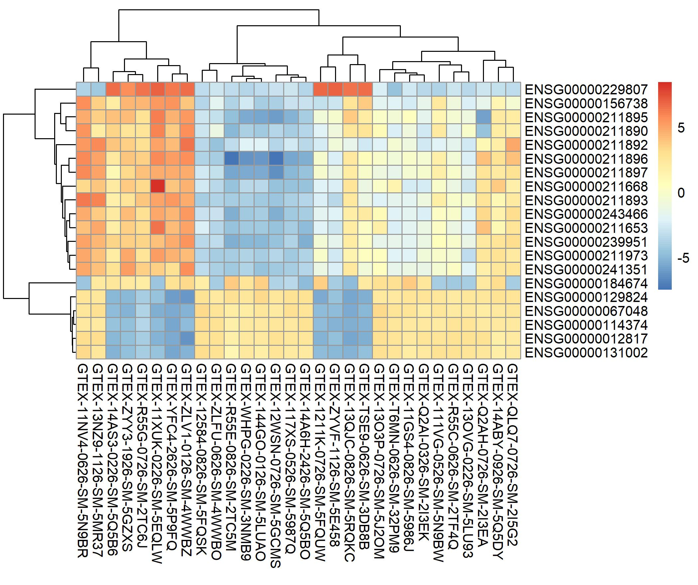

```{r setup, include=FALSE}
knitr::opts_chunk$set(echo = TRUE)
```

Enlace al repositorio de github: https://github.com/alexarredondodentaid/PEC2_ADO.git

# Abstract

Con el objetivo de implementar un *pipeline* de análisis de datos Ref-Seq y asimilar los conocimientos necesarios para ello, en esta PEC se analizaron 30 muestras de tejido tiroidal, repartidas en 3 grupos de 10 muestras cada una: *Not infiltrated tissues* (NIT), *Small focal infiltrates* (STI) y *Extensive lymphoid infiltrates* (ELI). Se buscaron diferencias significativas en la expresión genética de los distintos grupos utilizando el paquete DESeq2 de Bioconductor, encontrando genes sobre y subexpresados en todas las comparaciones.

# Objetivos

El objetivo de esta PEC es el de comparar los perfiles de expresión genética de 3 tipos de muestra de tejido tiroidal a partir de unos archivos targets.csv y counts.csv ya suministrados en el enunciado.

# Materiales y métodos

## Naturaleza de los datos

Los datos provienen del repositorio GTEx (Gentoype-Tissue Expression project), el cual pone a disposición pública datos de expresión genética de 54 tipos de tejidos sanos obtenidos de cerca de 1000 sujetos. En esta PEC se emplearon datos de tejido tiroidal, partiendo de un dataset en el que había 292 muestras de 3 grupos distintos:

- *Not infiltrated tissues* (NIT): 236 muestras.
- *Small focal infiltrates* (SFI): 42 muestras.
- *Extensive lymphoid infiltrates* (ELI): 14 muestras.

Sin embargo, para simplificar los cálculos y para igualar el número de muestras de los distintos grupos, en este estudio se pidió utilizar 10 muestras aleatorias de cada grupo, lo cual se realizó mediante un script que se desarolla en el siguiente apartado. 

## Métodos y herramientas utilizados en el análisis

Para realizar el análisis de expresión se ha utilizado el software RStudio junto con el paquete DESeq2, el cual proporciona funciones integradas para este tipo de estudios. 

Para obtener 10 muestras aleatorias de cada tipo, se utilizó el código del apéndice 1, en el que en primer lugar se separaron del archivo targets.csv las muestras según el grupo (ELI, SFI o NIT) y después se aleatorizaron 10 muestras de cada uno utilizando la funcion `sample`. Después se unieron bajo un mismo data frame para tener las 30 muestras deseadas. Para seleccionar los contajes correspondientes a las muestras, se utilizó la variable `Sample_Name` como filtro, quedándonos con las 30 columnas de counts.csv que nos interesaban.

Una vez seleccionados los datos, se utilizó el paquete DESeq2 para filtrar aquellos contajes que mostraran un nivel global de expresión muy bajo (< 1 en el total de las muestras). Posteriormente, mediante la función `vst` se normalizaron los datos según el concepto de la transformación estabilizadora de la varianza. El código puede consultarse en el apéndice 2.

Para agrupar las muestras según su expresión diferencial genética se utilizó el código disponible en el apéndice 3. En este análisis se hizo un agrupamiento según la distancia de los datos que se muestra en un mapa de calor y en un agrupamiento PCA (Principal Componen Analysis).

Para determinar quantitativamente la diferencia de expresión de genes concretos en las distintas comparaciones, se utilizó la función `results` del paquete DESeq2, introduciendo los contrastes NIT vs SFI, ELI vs SFI y ELI vs NIT (apéndice 4). La cantidad de genes sobre y subexpresados fueron resumidos, primero filtrando por aquellos con un *p* valor < 0.05 y después ordenando de manera que se mostraran los 20 genes más sobreexpresados y los 20 genes más subexpresados de cada comparación. Se realizó un mapa de calor de estas comparaciones mediante la función `pheatmap`, mostrando las agrupaciones más significativas encontradas. 

Finalmente, se realizó un análisis de significación biológica de los genes elegidos, añadiendo el código GO y SYMBOL a las tablas de expresión diferencial. Dichas tablas fueron exportadas a formato `.csv` (apéndice 5) y, manualmente, se añadió la función biológica de cada código GO.

# Resultados

```{r message=FALSE, warning=FALSE, include=FALSE}
library("GenomicAlignments")
library("BiocParallel")
library("DESeq2")
library("dplyr")
library("ggplot2")
library("vsn")
library("pheatmap")
library("RColorBrewer")
library("ggbeeswarm")
library("genefilter")
library("AnnotationDbi")
library("org.Hs.eg.db")
library("readxl")
```


```{r message=FALSE, warning=FALSE, include=FALSE}
setwd(".")
dir.create("data")
dir.create("results")
```

```{r message=FALSE, warning=FALSE, include=FALSE}

targets <- read.csv("./data/targets.csv")
counts <- read.csv("./data/counts.csv", sep = ";")

set.seed(123)
subsample_eli <- subset(targets, Group == "ELI")
subsample_sfi <- subset(targets, Group == "SFI")
subsample_nit <- subset(targets, Group == "NIT")
random_eli <- subsample_eli[sample(nrow(subsample_eli), 10),]
random_sfi <- subsample_sfi[sample(nrow(subsample_sfi), 10),]
random_nit <- subsample_nit[sample(nrow(subsample_nit), 10),]

random_targets <- rbind(random_eli, random_sfi, random_nit)
row.names(random_targets) <- random_targets$Sample_Name

colnames(counts) <- gsub("\\.", "-", colnames(counts))

random_names <- c(as.character(random_targets$Sample_Name))

random_df <- counts[random_names]
Ensembl <- counts$X
Ensembl <- gsub("\\..*", "", Ensembl, fixed = FALSE)
row.names(random_df) <- Ensembl
```

```{r message=FALSE, warning=FALSE, include=FALSE}
dds <- DESeqDataSetFromMatrix(countData = random_df, colData = random_targets, design = ~ Group)
nrow(dds)

dds <- dds[rowSums(counts(dds)) > 1,]
nrow(dds)
```

En el proceso de filtraje se observó una reducción en el número de genes de 12838, los cuales correspondían a genes que mostraron muy poca o ninguna expresión diferencial.

```{r message=FALSE, warning=FALSE, include=FALSE}
vsd <- vst(dds, blind = FALSE)
```

La normalización de los datos mediante la función `vst` permitió visualizar los resultados obtenidos mediante un gráfico (figura 1), el cual confirmaba que los datos estaban bien normalizados y que el procedimiento podía continuar.

```{r echo=FALSE, message=FALSE, warning=FALSE}
meanSdPlot(assay(vsd))
```
**Figura 1.** Gráfico que muestra la desviación estándar en función de la media. Como se puede ver, y a pesar de que hay algunos outliers, la desviación estándar es suficientemente baja como para aceptar la transformación realizada 

```{r message=FALSE, warning=FALSE, include=FALSE}
sampleDists <- dist(t(assay(vsd)))
sampleDistMatrix <- as.matrix(sampleDists)
rownames(sampleDistMatrix) <- paste(vsd$Sample_Name, vsd$Group, sep = " - ")
colnames(sampleDistMatrix) <- NULL
colors <- colorRampPalette(rev(brewer.pal(9,"Blues")))(255)
```

Se hizo un análisis para determinar como se agrupaban los datos. Los resultados se pueden observar en las figuras 2 y 3.

```{r echo=FALSE, message=FALSE, warning=FALSE}
pheatmap(sampleDistMatrix, clustering_distance_rows = sampleDists, clustering_distance_cols = sampleDists, col = colors)
```
**Figura 2.** Mapa de calor en el que se muestran las similitudes entre muestras a partir de los datos obtenidos de la función `vst`. Se puede observar dos agrupameintos: las muestras ELI por un lado y las NIT y SIF por el otro.  

```{r echo=FALSE, message=FALSE, warning=FALSE}
plotPCA(vsd, intgroup = c("Group"))
```
**Figura 3.** Gráfico PCA a partir de los datos obtenidos con la función `vst`. Se confirman los resultados mostrados en la figura 2, en la que se agrupan las muestras ELI por un lado y las NIT y SIF por el otro.


```{r message=FALSE, warning=FALSE, include=FALSE}
dds <- DESeq(dds, parallel = TRUE)

res_nit_sfi <- results(dds, contrast = c("Group", "NIT", "SFI"))
res_eli_sfi <- results(dds, contrast = c("Group", "ELI", "SFI"))
res_eli_nit <- results(dds, contrast = c("Group", "ELI", "NIT"))

res_nit_sfi_adj <- subset(res_nit_sfi, padj < 0.05)
res_eli_sfi_adj <- subset(res_eli_sfi, padj < 0.05)
res_eli_nit_adj <- subset(res_eli_nit, padj < 0.05)
```

```{r message=FALSE, warning=FALSE, include=FALSE}
topVarGenes <- head(order(rowVars(assay(vsd)), decreasing = TRUE), 20)

mat <- assay(vsd)[topVarGenes, ]
mat <- mat - rowMeans(mat)

anno <- as.data.frame(colData(vsd)[,c("Group")])
pheatmap(mat, annotacion_col = anno, filename = "./results/heatmapclustered.jpeg", cellheight = 10)
```

Para observar si se daba agrupamiento entre la expresión diferencial de ciertos genes y ciertas muestas, se realizó un mapa de calor (figura 4), en el que se observaron agrupamientos claros entre la sobre y subexpresión de algunos genes en ciertas muestras.


**Figura 4.** Mapa de calor en el que se agrupan los genes que han mostrado una mayor expresión diferencial junto con las muestras en las que se ha observado dicha expresión. En el eje X se disponen las muestras, mientras que en el eje Y los genes diferencialmente expresados. 

```{r message=FALSE, warning=FALSE, include=FALSE}
res_nit_sfi_adj$symbol <- mapIds(org.Hs.eg.db, keys=row.names(res_nit_sfi_adj), column = "SYMBOL", keytype = "ENSEMBL", multiVals = "first")
res_nit_sfi_adj$GO <- mapIds(org.Hs.eg.db, keys=row.names(res_nit_sfi_adj), column = "GO", keytype = "ENSEMBL", multiVals = "first")

res_eli_sfi_adj$symbol <- mapIds(org.Hs.eg.db, keys=row.names(res_eli_sfi_adj), column = "SYMBOL", keytype = "ENSEMBL", multiVals = "first")
res_eli_sfi_adj$GO <- mapIds(org.Hs.eg.db, keys=row.names(res_eli_sfi_adj), column = "GO", keytype = "ENSEMBL", multiVals = "first")

res_eli_nit_adj$symbol <- mapIds(org.Hs.eg.db, keys=row.names(res_eli_nit_adj), column = "SYMBOL", keytype = "ENSEMBL", multiVals = "first")
res_eli_nit_adj$GO <- mapIds(org.Hs.eg.db, keys=row.names(res_eli_nit_adj), column = "GO", keytype = "ENSEMBL", multiVals = "first")

res_nit_sfi_adjDF <- as.data.frame(res_nit_sfi_adj)
res_nit_sfi_adjDFsobre <- res_nit_sfi_adjDF[order(res_nit_sfi_adj$log2FoldChange, decreasing = TRUE),]
write.csv(res_nit_sfi_adjDFsobre[1:20,], file="./results/resultats_NITvsSFIsobre.csv")

res_eli_sfi_adjDF <- as.data.frame(res_eli_sfi_adj)
res_eli_sfi_adjDFsobre <- res_eli_sfi_adjDF[order(res_eli_sfi_adj$log2FoldChange, decreasing = TRUE),]
write.csv(res_eli_sfi_adjDFsobre[1:20,], file="./results/resultats_ELIvsSFIsobre.csv")

res_eli_nit_adjDF <- as.data.frame(res_eli_nit_adj)
res_eli_nit_adjDFsobre <- res_eli_nit_adjDF[order(res_eli_nit_adj$log2FoldChange, decreasing = TRUE),]
write.csv(res_eli_nit_adjDFsobre[1:20,], file="./results/resultats_ELIvsNITsobre.csv")

res_nit_sfi_adjDFsub <- res_nit_sfi_adjDF[order(res_nit_sfi_adj$log2FoldChange),]
write.csv(res_nit_sfi_adjDFsub[1:20,], file="./results/resultats_NITvsSFIsub.csv")

res_eli_sfi_adjDFsub <- res_eli_sfi_adjDF[order(res_eli_sfi_adj$log2FoldChange),]
write.csv(res_eli_sfi_adjDFsub[1:20,], file="./results/resultats_ELIvsSFIsub.csv")

res_eli_nit_adjDFsub <- res_eli_nit_adjDF[order(res_eli_nit_adj$log2FoldChange),]
write.csv(res_eli_nit_adjDFsub[1:20,], file="./results/resultats_ELIvsNITsub.csv")
```

El listado de los 20 genes más sobreexpresados y subexpresados de cada comparación, con el cambio expresado en logaritmo en base 2 (columna Dif.), se muestran en las siguientes tablas:

```{r message=FALSE, warning=FALSE, include=FALSE}
eli_nit_sobre <- read_excel("./results/ELIvsNITsobre.xlsx")
eli_nit_sub <- read_excel("./results/ELIvsNITsub.xlsx")
eli_sfi_sobre <- read_excel("./results/ELIvsSFIsobre.xlsx")
eli_sfi_sub <- read_excel("./results/ELIvsSFIsub.xlsx")
nit_sfi_sobre <- read_excel("./results/NITvsSFIsobre.xlsx")
nit_sfi_sub <- read_excel("./results/NITvsSFIsobre.xlsx")
```

**Genes sobreexpresados en la comparación ELI vs NIT**
```{r echo=FALSE, message=FALSE, warning=FALSE}
columnes <- c(1,3,10)
eli_nit_sobre[,columnes]
```

**Genes subexpresados en la comparación ELI vs NTI**
```{r echo=FALSE, message=FALSE, warning=FALSE}
eli_nit_sub[,columnes]
```

**Genes sobreexpresados en la comparación ELI vs SFI**
```{r echo=FALSE, message=FALSE, warning=FALSE}
eli_sfi_sobre[,columnes]
```

**Genes subexpresados en la comparación ELI vs SFI**
```{r echo=FALSE, message=FALSE, warning=FALSE}
eli_sfi_sub[,columnes]
```

**Genes sobreexpresados en la comparación NIT vs SFI**
```{r echo=FALSE, message=FALSE, warning=FALSE}
nit_sfi_sobre[,columnes]
```

**Genes subexpresados en la comparación NIT vs SFI**
```{r echo=FALSE, message=FALSE, warning=FALSE}
nit_sfi_sub[,columnes]
```

Para una mejor visualización de los datos ampliados consultar los archivos `.xlsx` disponibles en la carpeta `results` del repositorio de github.

# Discusión

La principal limitación de este estudio se ha dado al analizar la significación biológica. Si bien es cierto que se han proporcionado los datos correspondientes a los 20 genes más sobreexpresados y subexpresados, lo cual ya cubre una parte importante de la información necesaria, también es cierto que el investigador que quiera analizar la totalidad de los datos agradecería tener los datos de significación biológica de todas las muestras. Esto no fue posible debido a cierta compatibilidad de librerías encontrada en RStudio, por lo que se optó por anotar los genes manualmente, lo cual *imposibilita* anotar más de 40.000 genes. 

Hay que destacar que una parte nada desdeñable de los genes con mayor expresión diferencial no pudieron ser anotados debido a que no tenían un código GO asociado. Se podría haber optado por eliminar estos genes y proporcionar información únicamente acerca de aquellos genes con código GO. Sin embargo, se optó por añadirlos al informe debido a su *posible* significación biológica. Por ejemplo, al comparar la expresión genética entre muestras ELI y NIT, se observó que el gen ENSG00000253274 mostraba una expresión diferencial de 8.76 log2 y sin embargo no se encontró un código GO asociado. Es de esperar que el investigador que reciba un informe de estas características quiera conocer los genes con expresión diferencial tengan o no un código GO asociado, y por lo tanto se decidió incluirlo en el informe. 

# Apéndice

## Apéndice 1

Código empleado para la obtención de las 30 muestras aleatorias.
```{r eval=FALSE}
# Leemos los archuvos facilitados para el estudio
targets <- read.csv("./data/targets.csv")
counts <- read.csv("./data/counts.csv", sep = ";")

# Extraemos los 3 grupos (NIT, SFI y ELI) y seleccionamos 10 muestras aleatorias de cada
set.seed(123)
subsample_eli <- subset(targets, Group == "ELI")
subsample_sfi <- subset(targets, Group == "SFI")
subsample_nit <- subset(targets, Group == "NIT")
random_eli <- subsample_eli[sample(nrow(subsample_eli), 10),]
random_sfi <- subsample_sfi[sample(nrow(subsample_sfi), 10),]
random_nit <- subsample_nit[sample(nrow(subsample_nit), 10),]

random_targets <- rbind(random_eli, random_sfi, random_nit)
row.names(random_targets) <- random_targets$Sample_Name

# Puesto que existe una diferencia entre el nombre de la muestra en el dataset counts vs 
# el dataset targets, realizamos una modificación para equipararlos:
colnames(counts) <- gsub("\\.", "-", colnames(counts))

# Ahora seleccionamos los datos del dataset counts basándonos en las muestras elegidas
random_names <- c(as.character(random_targets$Sample_Name))

# Modificamos el nombre de la referencia Ensembl para evitar problemas más adelante 
# del pipeline:
random_df <- counts[random_names]
Ensembl <- counts$X
Ensembl <- gsub("\\..*", "", Ensembl, fixed = FALSE)
row.names(random_df) <- Ensembl
```

## Apéndice 2

Código empleado para el filtraje de genes con poca expresión y la normalización de los datos.
```{r eval=FALSE}
dds <- DESeqDataSetFromMatrix(countData = random_df, colData = random_targets, 
                              design = ~ Group)
nrow(dds)

# Filtramos (eliminamos aquellas filas que solo tienen 0s o 1s)
dds <- dds[rowSums(counts(dds)) > 1,]
nrow(dds)

# Restando las filas obtenidas anteriormente y las actuales, calculmaos cuantos genes 
# no han mostrado expresión diferencial.

# Normalizamos según el ooncepto de la transformación estabilizadora de la varianza:
vsd <- vst(dds, blind = FALSE)
head(assay(vsd))

# Comprobamos los efectos en un gráfico:
meanSdPlot(assay(vsd))
```

## Apéndice 3

Código para las figuras 2 y 3
```{r eval=FALSE}
# Calculamos como de distinas son las muestras entre si:
sampleDists <- dist(t(assay(vsd)))
sampleDistMatrix <- as.matrix(sampleDists)
rownames(sampleDistMatrix) <- paste(vsd$Sample_Name, vsd$Group, sep = " - ")
colnames(sampleDistMatrix) <- NULL
colors <- colorRampPalette(rev(brewer.pal(9,"Blues")))(255)

pheatmap(sampleDistMatrix, clustering_distance_rows = sampleDists,
         clustering_distance_cols = sampleDists, col = colors)

# Hacemos un gráfico PCA para representar los agrupamientos de otro modo:
plotPCA(vsd, intgroup = c("Group"))
```

## Apéndice 4

Código para la selección de aquellos genes más sobre y subexpresados de cada comparación y para la realización de la figura 4.
```{r eval=FALSE}
# Empezamos el análisis de expresión diferencial
dds <- DESeq(dds, parallel = TRUE)

# Realizamos primero el contraste entre las comparaciones de los grupos:
res_nit_sfi <- results(dds, contrast = c("Group", "NIT", "SFI"))
res_eli_sfi <- results(dds, contrast = c("Group", "ELI", "SFI"))
res_eli_nit <- results(dds, contrast = c("Group", "ELI", "NIT"))

# Ahora comprobamos los (como máximo) 20 genes más sobreexpresados y los 20 genes 
# más subexpresados en cada comparación usando un padj < 0.05
res_nit_sfi_adj <- subset(res_nit_sfi, padj < 0.05)
res_eli_sfi_adj <- subset(res_eli_sfi, padj < 0.05)
res_eli_nit_adj <- subset(res_eli_nit, padj < 0.05)

# Subexpresados:
head(res_nit_sfi_adj[order(res_nit_sfi_adj$log2FoldChange),], 20)
head(res_eli_sfi_adj[order(res_eli_sfi_adj$log2FoldChange),], 20)
head(res_eli_nit_adj[order(res_eli_nit_adj$log2FoldChange),], 20)

# Sobreexpresados:
head(res_nit_sfi_adj[order(res_nit_sfi_adj$log2FoldChange, decreasing = TRUE),], 20)
head(res_eli_sfi_adj[order(res_eli_sfi_adj$log2FoldChange, decreasing = TRUE),], 20)
head(res_eli_nit_adj[order(res_eli_nit_adj$log2FoldChange, decreasing = TRUE),], 20)

# Hacemos una representación gráfica de los clusters de genes más diferenciadps
topVarGenes <- head(order(rowVars(assay(vsd)), decreasing = TRUE), 20)

mat <- assay(vsd)[topVarGenes, ]
mat <- mat - rowMeans(mat)

anno <- as.data.frame(colData(vsd)[,c("Group")])
pheatmap(mat, annotacion_col = anno)
```

## Apéndice 5

Código para la adición de la información biológica de los genes.
```{r eval=FALSE}
# Anotamos y exportamos los resultados (significación biológica)

# Añadimos el nombre del gen "SYMBOL" y "GO" 
res_nit_sfi_adj$symbol <- mapIds(org.Hs.eg.db, keys=row.names(res_nit_sfi_adj), 
                          column = "SYMBOL", keytype = "ENSEMBL", multiVals = "first")
res_nit_sfi_adj$GO <- mapIds(org.Hs.eg.db, keys=row.names(res_nit_sfi_adj), 
                      column = "GO", keytype = "ENSEMBL", multiVals = "first")

res_eli_sfi_adj$symbol <- mapIds(org.Hs.eg.db, keys=row.names(res_eli_sfi_adj), 
                          column = "SYMBOL", keytype = "ENSEMBL", multiVals = "first")
res_eli_sfi_adj$GO <- mapIds(org.Hs.eg.db, keys=row.names(res_eli_sfi_adj),
                      column = "GO", keytype = "ENSEMBL", multiVals = "first")

res_eli_nit_adj$symbol <- mapIds(org.Hs.eg.db, keys=row.names(res_eli_nit_adj), 
                          column = "SYMBOL", keytype = "ENSEMBL", multiVals = "first")
res_eli_nit_adj$GO <- mapIds(org.Hs.eg.db, keys=row.names(res_eli_nit_adj), 
                      column = "GO", keytype = "ENSEMBL", multiVals = "first")

# Exportamos las tablas de los sobreexpresados
res_nit_sfi_adjDF <- as.data.frame(res_nit_sfi_adj)
res_nit_sfi_adjDFsobre <- res_nit_sfi_adjDF[order(res_nit_sfi_adj$log2FoldChange,
                                                  decreasing = TRUE),]
write.csv(res_nit_sfi_adjDFsobre[1:20,], file="./results/resultats_NITvsSFIsobre.csv")

res_eli_sfi_adjDF <- as.data.frame(res_eli_sfi_adj)
res_eli_sfi_adjDFsobre <- res_eli_sfi_adjDF[order(res_eli_sfi_adj$log2FoldChange, 
                                                  decreasing = TRUE),]
write.csv(res_eli_sfi_adjDFsobre[1:20,], file="./results/resultats_ELIvsSFIsobre.csv")

res_eli_nit_adjDF <- as.data.frame(res_eli_nit_adj)
res_eli_nit_adjDFsobre <- res_eli_nit_adjDF[order(res_eli_nit_adj$log2FoldChange, 
                                                  decreasing = TRUE),]
write.csv(res_eli_nit_adjDFsobre[1:20,], file="./results/resultats_ELIvsNITsobre.csv")

# Exportamos las tablas de los subexpresados
res_nit_sfi_adjDFsub <- res_nit_sfi_adjDF[order(res_nit_sfi_adj$log2FoldChange),]
write.csv(res_nit_sfi_adjDFsub[1:20,], file="./results/resultats_NITvsSFIsub.csv")

res_eli_sfi_adjDFsub <- res_eli_sfi_adjDF[order(res_eli_sfi_adj$log2FoldChange),]
write.csv(res_eli_sfi_adjDFsub[1:20,], file="./results/resultats_ELIvsSFIsub.csv")

res_eli_nit_adjDFsub <- res_eli_nit_adjDF[order(res_eli_nit_adj$log2FoldChange),]
write.csv(res_eli_nit_adjDFsub[1:20,], file="./results/resultats_ELIvsNITsub.csv")

# Leemos las nuevas tablas modificadas manualmente:
eli_nit_sobre <- read_excel("./results/ELIvsNITsobre.xlsx")
eli_nit_sub <- read_excel("./results/ELIvsNITsub.xlsx")
eli_sfi_sobre <- read_excel("./results/ELIvsSFIsobre.xlsx")
eli_sfi_sub <- read_excel("./results/ELIvsSFIsub.xlsx")
nit_sfi_sobre <- read_excel("./results/NITvsSFIsobre.xlsx")
nit_sfi_sub <- read_excel("./results/NITvsSFIsobre.xlsx")
```

